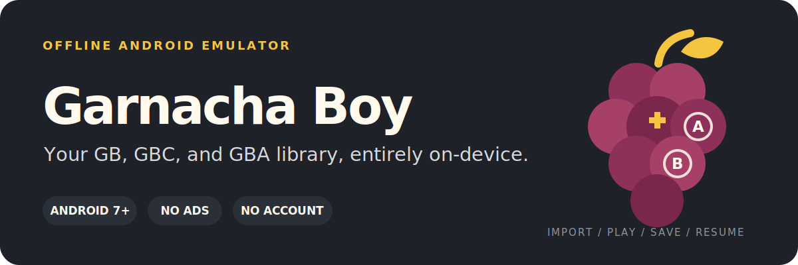
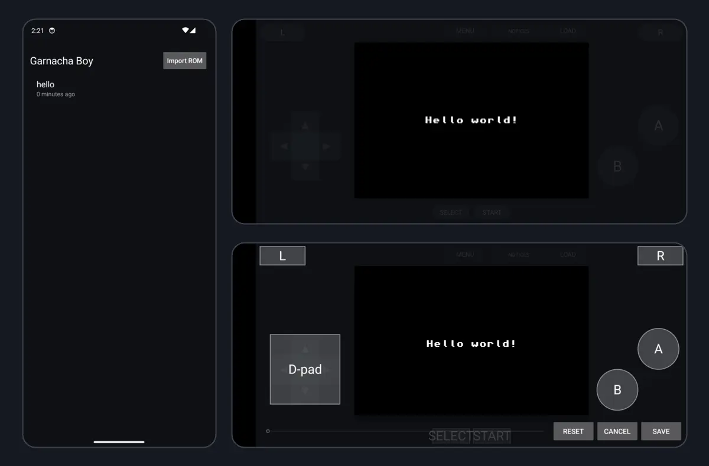

<p align="center">
  
</p>

<p align="center">
  Free and ad-free. Bring your own games; Garnacha Boy keeps your library, saves, and play history on your device.
</p>

<p align="center">
  <a href="https://github.com/TrebuchetDynamics/garnacha-boy-android/releases"><strong>Releases</strong></a> ·
  <a href="#how-it-works">How it works</a> ·
  <a href="#privacy-by-default">Privacy</a> ·
  <a href="#build-from-source">Build from source</a>
</p>

## Get Garnacha Boy

Official APKs are distributed through [GitHub Releases](https://github.com/TrebuchetDynamics/garnacha-boy-android/releases). If that page has no APK, a public production-signed build has not been published yet.

When a release is available:

1. Download the `garnacha-boy-v*.apk` file from the release.
2. Open it on your Android device. Android may ask you to allow installs from your browser or file manager.
3. Launch Garnacha Boy and import a game you are authorized to use.

> Only release APKs from this repository are official. Local and benchmark builds use Android's debug signing key and are not production releases.

## See it in action

<p align="center">
  
</p>

<p align="center"><sub>Validated development builds: library, landscape play, and the touch-control layout editor.</sub></p>

## How it works

1. **Import** a `.gb`, `.gbc`, `.gba`, or ZIP file through Android's document picker.
2. **Play** with on-screen controls or a mapped physical controller.
3. **Save** with normal cartridge saves, four manual save-state slots, and rotating autosaves.
4. **Resume** from your library, rewind recent play, or fast-forward slower sections.

Garnacha Boy uses the pinned, unmodified [mGBA](https://github.com/mgba-emu/mgba) `0.10.5` core for Game Boy, Game Boy Color, and Game Boy Advance emulation.

## What you can customize

- Portrait or landscape play with editable touch-control layouts
- Controller button remapping and touch haptics
- Crisp integer scaling or fill-screen scaling
- Game Boy palettes, audio volume, and frameskip
- Touch-control visibility and opacity
- Fast-forward speed, screenshots, rewind, and reset protection

## Privacy by default

- **No network permission:** the Android manifest intentionally omits `INTERNET`.
- **No ads, telemetry, or account:** gameplay does not depend on an online service.
- **Private storage:** imported games, cartridge saves, save states, and play history stay in app-private storage.
- **No cloud backup:** app backup is disabled. Uninstalling Garnacha Boy—or deleting a game from its library—removes its private copy and associated saves, so keep your own backups.

## Compatibility

| | Support |
|---|---|
| Android | 7.0 or newer (`minSdk 24`) |
| Devices | `arm64-v8a` and `x86_64` |
| Game files | `.gb`, `.gbc`, `.gba`, and ZIP imports |
| Emulator core | mGBA `0.10.5` |

### Current limits

- Games and proprietary BIOS files are not included. Supply only content you are legally authorized to use.
- Bluetooth and USB controller remapping exists, but physical-controller coverage is still limited.
- Battery life, sustained thermals, and performance on low-end Android hardware remain unverified.

## Build from source

<details>
<summary><strong>Developer build and test commands</strong></summary>

### Requirements

JDK 17, Android SDK 35, NDK `22.1.7171670`, CMake `3.18.1`, and Ninja.

```sh
git submodule update --init --recursive
mgba-android/gradlew -p mgba-android clean lintDebug \
  :app:testDebugUnitTest :app:assembleBenchmark \
  :core:assembleBenchmark :core:assembleDebugAndroidTest

cmake -S mgba-android/smoke -B build/mgba-smoke -G Ninja \
  -DCMAKE_BUILD_TYPE=Release
cmake --build build/mgba-smoke
ctest --test-dir build/mgba-smoke --output-on-failure
```

Build outputs:

- APK: `mgba-android/app/build/outputs/apk/benchmark/app-benchmark.apk`
- reusable mGBA AAR: `mgba-android/core/build/outputs/aar/core-benchmark.aar`

The benchmark APK is optimized but debug-signed. Tagged production releases are built by [`.github/workflows/release.yml`](.github/workflows/release.yml) and fail closed unless release-signing secrets are configured.

[](https://github.com/TrebuchetDynamics/garnacha-boy-android/actions/workflows/deploy_android.yml)
[](https://github.com/TrebuchetDynamics/garnacha-boy-android/actions/workflows/release.yml)

See [`mgba-android/README.md`](mgba-android/README.md) for implementation and validation details, [`MVP.md`](MVP.md) for the build contract, and [`docs/`](docs/) for architecture decisions and device-test receipts.

</details>

## Open source and legal

Garnacha Boy and canonical mGBA are provided under the [Mozilla Public License 2.0](LICENSE). The pinned mGBA source remains unmodified, and its license ships in the app and AAR notices. See [`ACKNOWLEDGMENTS.md`](ACKNOWLEDGMENTS.md) for attribution details.

Garnacha Boy is not affiliated with or endorsed by Nintendo or mGBA.
